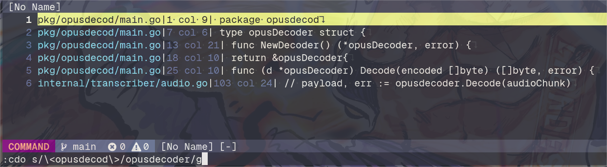

+++
title = "Quick tip: Find and replace with Neovim"
date = "2023-12-03"
tags = ["neovim"]
categories = ["post"]
draft = false
+++

In this article I describe how to replace some word on multiple files using neovim. 

Use `:Telescope live_grep` to search for what you want to replace:


Populate the results to the *quick fix list* with `ctrl + q`


Then run find and replace: 
```sh
:cdo s/search/replace/g
```
The :cdo will execute the specified command in every entry in the quick fix list.



After that, every entry have to be saved, you can go in every buffer and save manually or to save every buffer:
```sh
:cdo update
```

# References
- [Quickfix](https://neovim.io/doc/user/quickfix.html)
- [Telescope](https://github.com/nvim-telescope/telescope.nvim)
