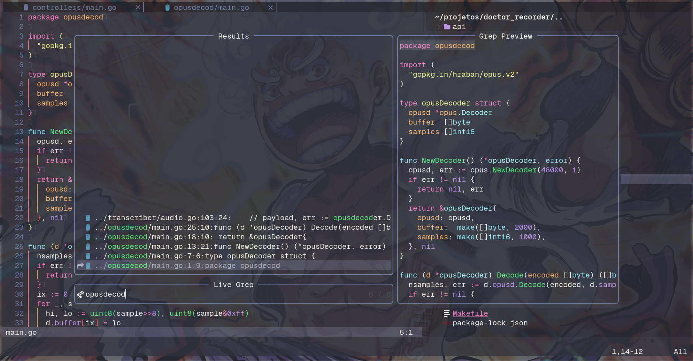

+++
title = "Quick tip: Find and replace with Neovim"
date = "2023-12-03"
tags = ["neovim"]
categories = ["post"]
draft = false
+++

In this article, I'll guide you through replacing a word across multiple files using Neovim. We'll use the `Telescope` plugin for searching and the quickfix list for applying changes efficiently.

## Step 1: Search with Telescope

First, use `:Telescope live_grep` to search for the word or pattern you want to replace.



## Step 2: Send Results to the Quickfix List

Once you have your search results, send them to the quickfix list by pressing `Ctrl + q`.


### Step 3: Find and Replace

Now, it's time to run the find-and-replace command. Use the following command to replace all instances of the word in the quickfix list:

```sh
:cdo s/search/replace/g
```
The `:cdo` command runs the specified substitution (s/search/replace/g) for each entry in the quickfix list.


## Step 4: Save Changes
After replacing the word, you'll need to save the changes in each buffer. You can either manually save each buffer or use the following command to update all buffers at once:

```sh
:cdo update
```

# References
- [Quickfix](https://neovim.io/doc/user/quickfix.html)
- [Telescope](https://github.com/nvim-telescope/telescope.nvim)
