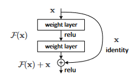

+++
title = "ResNet"
date = "2023-10-15"
tags = ["neural-networks", "machine-learning", "ai"]
draft = false
+++

# Redes Neurais Residuais (ResNet)

Com o aumento de camadas nas redes neurais os gradientes da função de perda acabam tendendo 0 dessa formas os pesoas da rede não são atualizados (conhecido como `Vanishing Gradient Problem`).

# Referencias

[1] [https://arxiv.org/pdf/1512.03385v1.pdf](https://arxiv.org/pdf/1512.03385v1.pdf)
[2] [https://medium.com/@ibtedaazeem/understanding-resnet-architecture-a-deep-dive-into-residual-neural-network-2c792e6537a9](https://medium.com/@ibtedaazeem/understanding-resnet-architecture-a-deep-dive-into-residual-neural-network-2c792e6537a9)
[3] [https://blog.paperspace.com/writing-resnet-from-scratch-in-pytorch/](https://blog.paperspace.com/writing-resnet-from-scratch-in-pytorch/)
