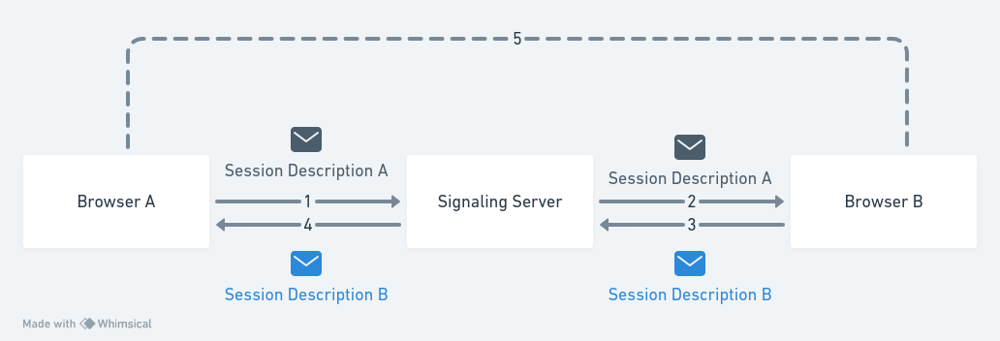

+++
title = "WebRTC"
date = "2023-11-02"
tags = ["protocols"]
draft = false
+++

With WebRTC you can stream audio, video (or both) and arbritary data between browsers performing peer-to-peer communication. This is really powerful. In this article I will explain how WebRTC

- acquiring audio or video
- communicating audio and video
- communicating arbritary data

# Javascript API

## MediaStream

Represents a stream of audio and/or video. It allows access to camera and microphone from host device. To get a MediaStream you can call `navigator.getUserMedia`

```js
var constraints = { video: true };

function onSuccess(stream) {
  var video = document.querySelector("video");
  video.src = window.URL.createObjectURL(stream);
}

function onError(error) {
  console.log("failed", error);
}

navigator.getUserMedia(constraints, onSuccess, onError);
```

With _constraints_ you can control the content of _MediaStream_, like frame rate, type, width and height of the video. To use audiowe have a similar api.

```js
function onSuccess(stream) {
  var audioContext = new webkitAudioContext();
  var mediaStreamSource = audioContext.createMediaStreamSource(stream);
  mediaStreamSource.connec(audioContext.destination);
}

navigator.webkitGetUserMedia({ audio: true }, onSuccess);
```

## RTCPeerConnection

It is where we setup peer to peer connection

## RTCDataChannel

Is the mechanism to send arbritary data over WebRTC with bidirectional connection.

```js
var pc = new webkitRTCPeerConnection(servers, {
  optional: [{ RtpDataChannels: true }],
});

pc.ondatachannel = function (event) {
  receiveChannel = event.channel;
  receiveChannel.onmessage = function (event) {
    console.log(event.data);
  };
};

sendChannel = pc.createDataChannel("sendDataChannel", { reliable: false });
sendChanel.send(data);
```

# Session Description Protocol or RTCSessionDescription

The configuration of WebRTC is called _session description_, it store information about the transfer protocol beeing used, the ip address, port, codecs and other data, here is an example:

```
v=0
o=alice 2890844526 2890844526 IN IP4 host.anywhere.com
s=
c=IN IP4 host.anywhere.com
t=0 0
m=audio 49170 RTP/AVP 0
a=rtpmap:0 PCMU/8000
m=video 51372 RTP/AVP 31
a=rtpmap:31 H261/90000
m=video 53000 RTP/AVP 32
a=rtpmap:32 MPV/90000
```

SDP is used with protocols like SRTP, RTP and RTSP. When a user start a WebRTC call this description is created and sent to the **signaling service**, this first communication is also called as **offer**. The other user respond with an **answer**, this way both devices have a local description and a remote description of the other end of the call.



This exchange of SDP is done not only in the begining of the communication but every time there is a need to change a configuration. After both sides have the SDP the peer-to-peer comunication can be started.

# Signaling

To create a WebRTC connection we need a server in the middle, because of the complexities and securities difficults that would arrise in a p2p connection between browsers. The serve with this pourpose is called _signaling service_ This service will exchange the SDP offer and answer between different peers.

There is a complexity that arrise when there is a NAT in the network, because each device behind NAT do share the same public ip which there is no way to stabilish the peer-to-peer communication.

# STUN

Is a protocol to facilitate the discovery of public addres of device in a NAT network, and determine restruction in your router that prevent peer-to-peer comunication, this solve the problem of device not having a public address in NAT. The client send a request to STUN to check the peer public address and if it is accessible, with help of NAT server a port is open so request can be fowarded to the peer. In some cases the NAT could restrict who can connect with a peer in his network


# TURN

Is a technology that provide a fallback when peer-to-peer is not possible, TURN server get a public address that do not restrict even if your are behind a proxy or a restrictive NAT router. The peer connect to TURN server and ask to relay the packets to the peer in the other end, it then foward this packages for you. This have someoverhead

# Architecture

You can connect multiple peers in the same connection as MESH where every peer connect to every other peer. This topology is limited by the number of peers in the connection, to handler more connection you could stabilish a STAR architecture where you peek the more capable device to send a copy of data to every other peer in the connection. To stabilish a most robust architecture you could use a MCU.

# Conclusion

WebRTC is a complex technology with multiple protocol working under the hood and with that different approaches

# References

- [Real-time communication with WebRTC: Google I/O 2013](https://youtu.be/p2HzZkd2A40)
- [WebRTC For The Curious](https://webrtcforthecurious.com/)
- [WebRTC: The secret power you didn't know Go has](https://www.youtube.com/watch?v=4kdU9_a-gII&ab_channel=Conf42)
- [Official website](https://webrtc.org/)
- [Codelab](https://codelabs.developers.google.com/codelabs/webrtc-web#0)
- [WebRTC in 100 seconds](https://www.youtube.com/watch?v=WmR9IMUD_CY)
